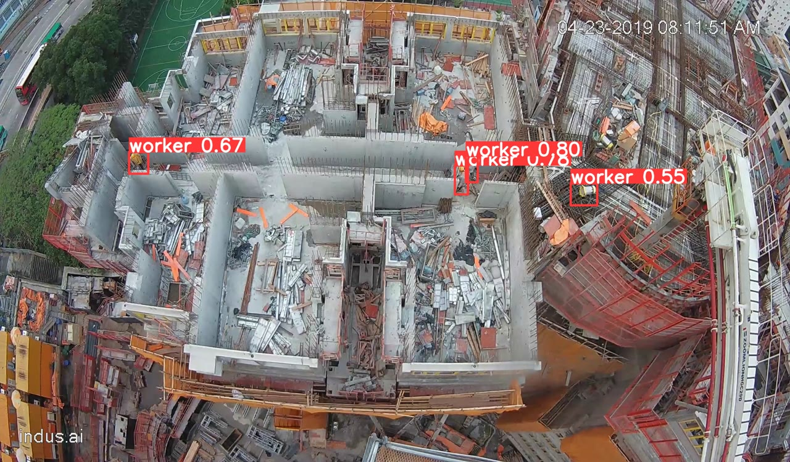
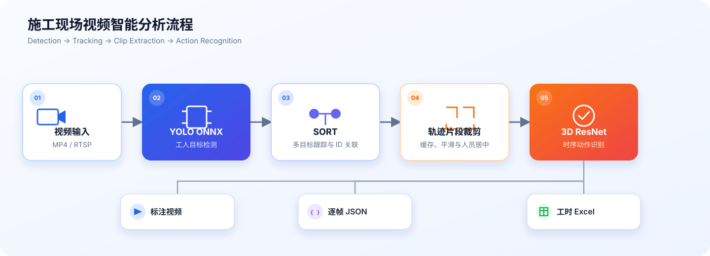

<div align="center">

# YOLO · SORT · 3D ResNet

**施工现场工人检测、持续跟踪与动作识别**

Construction worker detection, tracking and action recognition from video streams.


</div>



> 上图为 YOLO 工人检测阶段的真实视频帧。完整流程会进一步为每名工人分配跟踪 ID，并识别连续视频片段中的施工动作。

## 项目简介

本项目面向施工现场固定摄像头视频，将目标检测、多目标跟踪和时序动作识别组合为一条端到端分析链路。系统能够定位画面中的工人、维持跨帧身份、裁剪每名工人的轨迹片段，并统计不同施工行为的持续时间。

主要能力：

- 使用 YOLO 和 ONNX Runtime 检测施工人员。
- 使用 SORT、卡尔曼滤波和 IoU 匹配维持人员 ID。
- 使用 3D ResNet 对连续视频帧进行动作分类。
- 支持本地 MP4 文件与 RTSP 视频流。
- 输出标注视频、逐帧 JSON 结果和工时统计 Excel。
- 包含 YOLOv5/YOLOv8 训练、ONNX 导出及边缘设备性能报告。

## 处理流程



## 动作类别

| ID | Action | 含义 |
|---:|---|---|
| 0 | `clean` | 清理 |
| 1 | `concrete` | 混凝土作业 |
| 2 | `formwork` | 模板作业 |
| 3 | `prepare` | 准备 |
| 4 | `rebar` | 钢筋作业 |
| 5 | `rest/talk` | 休息或交谈 |
| 6 | `scaffold` | 脚手架作业 |
| 7 | `transport` | 运输 |
| 8 | `walk` | 行走 |

## 目录结构

```text
.
├── workflow/       # YOLO + SORT + 3D ResNet 完整推理流程
│   ├── work_flow.py
│   ├── itfvp/      # 检测器、视频输入输出和图像工具
│   ├── itfact/     # 动作识别封装
│   ├── tracker/    # SORT 跟踪器
│   └── resource/   # ONNX 与 TorchScript 模型
├── yolo/           # YOLOv5/YOLOv8 训练、导出和边缘测试
├── 3DResnet/       # 3D ResNet 训练、验证和模型导出
├── docs/assets/    # README 演示资源
└── requirements.txt
```

## 快速开始

### 1. 获取代码和模型

模型文件由 Git LFS 管理：

```bash
git clone git@github.com:Calvin-Ca/yolo-sort-resnet3d.git
cd yolo-sort-resnet3d
git lfs install
git lfs pull
```

### 2. 安装环境

建议使用带 CUDA 的 Python 3.9+ 环境，并确保系统已安装 FFmpeg：

```bash
python -m venv .venv
source .venv/bin/activate
pip install -r requirements.txt
```

### 3. 分析本地视频

输入和输出文件使用 `file://` URI：

```bash
python workflow/work_flow.py \
  --source file:///absolute/path/input.mp4 \
  --target file:///absolute/path/output.mp4 \
  --result_path file:///absolute/path/result.json \
  --excel_path file:///absolute/path/workhours.xlsx \
  --device 0
```

也可以将 `--source` 或 `--target` 设置为 RTSP 地址。若不需要生成标注视频，可以省略 `--target`。

## 模型训练

### YOLO

YOLOv5 和 YOLOv8 训练代码位于 [`yolo/`](yolo/)，项目脚本位于 [`yolo/scripts/`](yolo/scripts/)。训练数据及运行输出默认不提交到 Git。

### 3D ResNet

动作识别训练入口为 [`3DResnet/main.py`](3DResnet/main.py)，支持 ResNet、ResNet2+1D、ResNeXt、Wide ResNet 和 DenseNet 等时空网络。端到端 TorchScript 模型可通过 [`3DResnet/export.py`](3DResnet/export.py) 导出。

## 边缘设备测试

DeepStream + NvSORT + 3D Action 的 Jetson Orin NX 端到端结果见
[`workflow/deepstream/EDGE_BENCHMARK.md`](workflow/deepstream/EDGE_BENCHMARK.md)，
包含基线、同步/异步 Action 推理和时序降采样对比。

[`yolo/edge_pt/report/`](yolo/edge_pt/report/) 保存了不同模型、输入尺寸和批量大小在 Jetson Nano、Xavier NX、PC 等设备上的测试结果，可用于部署选型。

## 注意事项

- 完整 workflow 当前按 CUDA 设备编号初始化，运行前请确认 PyTorch 与 ONNX Runtime 能识别 GPU。
- Linux 输出依赖 `/usr/bin/ffmpeg`；Windows 版本需要根据本机安装位置调整 FFmpeg 路径。
- 模型、训练数据和视频文件体积较大，请使用 Git LFS 或外部数据存储管理。
